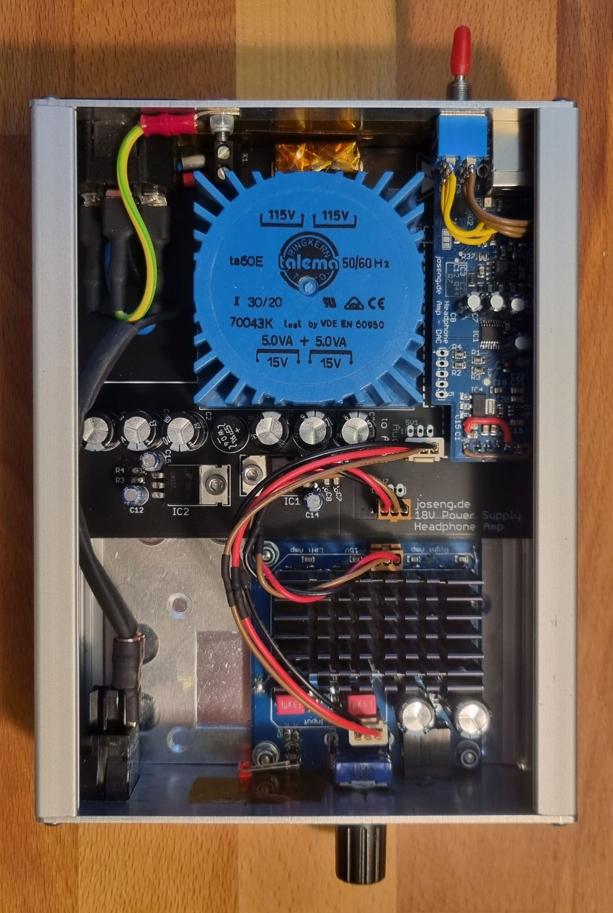
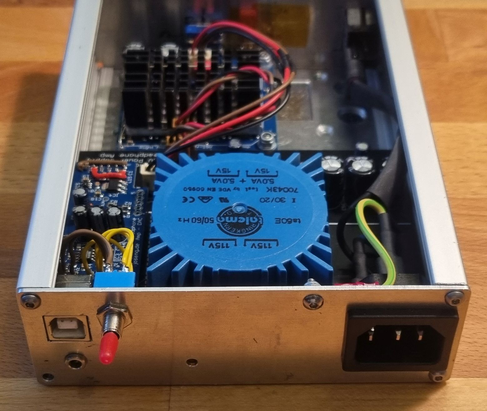

# Headphone Amplifier with 24bit DAC
A (massive) parallel OpAmp headphone amplifier using 16 parallel OpAmps per channel. The complete box has three PCBs: the power supply, a 24bit DAC with USB interface and the amplifier board itself (hidden under the black heatsink).

  
  
   

The amplifier PSU "base board" has an input for analog signals which can be routed to the amp board, or there can be a USB DAC board plugged in. When you want to switch between analog and USB input, you need to solder a switch to the base board connections of the DAC board (see in the pictures above).

# Noise
The reasoning behind the paralleling so much opamps is to decrease the noise during amplification and therefore improve the SNR. When using this headphone amp with the USB DAC board, we want to give some credit to the 24bit DAC and make the amp as low noise as possible.

In theory the noise is multiplied by the square root of N (number of amplifiers), instead of the number of amplifiers like the gain. Here is a good read: https://www.analog.com/en/technical-articles/paralleling-amplifiers-improves-signal-to-noise-performance.html

This is also the reasoning for the torodial transformer and the linear power supply.

One drawback of the parallel OpAmps is the waste heat, generated by the chips as they are driving their outputs against each other. Typically audio amplifiers are not "high precision" amps in terms of DC offset voltages, so each OpAmp has a different offset and therefore they all drive a bit of current all the time.

# Setting up the CP2114-B02 USB-I2S Bridge chip
Poorly the CP2114-B02 is also obsolete and I could not find any other replacement chip for USB to I2S which offers 24bit support. ONLY the -B02 version offers 24bit support. Maybe one can replace it with some Cypress FX2/FX3 chips or an AVR/SAM with a USB audio device firmware.

Anyways, how to configure the existing CP2114-B02: It has a One-Time Programmable ROM (chapter 3.6 in the datasheet), where config slots can be programmed with a PC tool. These slots contain information about clocking, audio data format and so on. The config is selected at startup by some bootstrapping pins, which means we do not have to configure the CP2114 with an MCU after we programmed it with the PC.

Steps to program the config:

1. Extract the PC utility called CP21xxCustomizationUtility from AN721SW.zip file, for your operating system
2. Connect the DAC board/the CP2114 via USB and power it up (could be in this headphone amplifier, or in your custom circuit)
3. Load the finished configuration from the file "ConfigData_24bit.txt" and click the "Program Device" button.

Ensure you selected the right config at the first time of programming, as each slot can only be written once. The next program cycle will write to the next slot, and you have to change then the config bootstrapping pin resistors to select the right config slot at startup!

After programming the chip, you need to uninstall it in the device manager and replug it, at least under windows, to make the new config take effect.

Some link collection used during the config creation:

* Only 24bit playback or recording at a time:
  * https://community.silabs.com/s/article/cp2114-b02-24-bit-record-playback-vs-16-bit-record-playback?language=en_US
  * https://community.silabs.com/s/article/cp2114-b02-audio-24-bit-mode?language=en_US
  * https://community.silabs.com/s/question/0D51M00007xeOMqSAM/does-the-cp2114b02-support-true-24-bits?language=en_US
* Bad noise (happend to me also), taken care in the config
  * https://community.silabs.com/s/question/0D51M00007xeE9cSAE/cp2114-crackling-or-choppy-noise?language=en_US
  * https://community.silabs.com/s/article/cp2114-and-asynchronous-mode?language=en_US
  * https://www.silabs.com/documents/public/errata/cp2114-errata.pdf chapter 3.2.1
* Distinguishing chip version: https://community.silabs.com/s/article/cp2114-b01-vs-b02-package-marking-1?language=en_US

# Replacement for the obsolete OPA2604
The internet delivers multiple alternatives for the obsolete OPA2604:
* OPA2134 (need to make sure the PSU PCB is tuned to +-15V!)
* OPA2227 (need to make sure the PSU PCB is tuned to +-15V!)
* OPA1642
* NE5534A (not a double opamp, not pin compatible)

Source: http://www.hifi-forum.de/viewthread-71-13538.html (german). Also with some good noise comparison charts.

# Housing

The housing is a proMa "Euro-Gehäuse EG 1" article number "131 020", e.g. available at [Reichelt](https://www.reichelt.de/de/en/euro-casing-geh-eg-1-p50423.html). The front and back are custom 3D prints. The front panel PCB is also custom made exactly for this housing, but is fairly easy modified for any other housing front.

# License
The content of this whole repository is licensed under [CERN-OHL-W](License/cern_ohl_w_v2.txt) or later by Jonas Eberhard.

Excepted is the software copied from Cypress in the AN721SW.zip file. This was copied to this repo for archiving purpose!